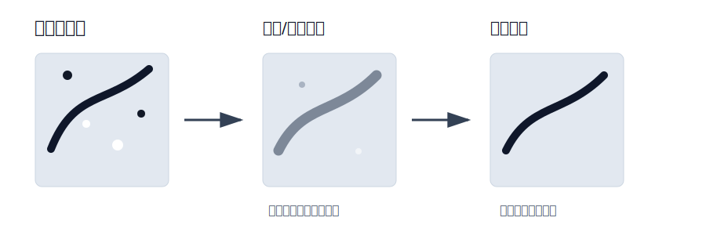
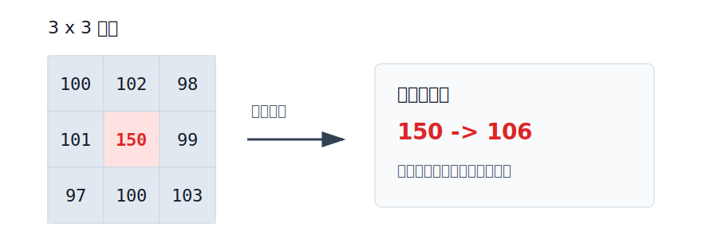

# 图像阈值与平滑处理

本节主要介绍 OpenCV 中两类常用图像预处理方法：

- **图像阈值处理**：把图像按照灰度值分成不同区域，常用于前景和背景分离；
- **图像平滑处理**：削弱噪声和细节变化，让图像变得更平滑。

**阈值处理常用于图像分割，平滑处理常用于图像去噪。**

## 核心知识点

| 模块 | 作用 | 常用函数 |
| --- | --- | --- |
| 固定阈值 | 使用一个固定阈值分割图像 | `cv2.threshold()` |
| 自适应阈值 | 根据局部区域自动计算阈值 | `cv2.adaptiveThreshold()` |
| Otsu 阈值 | 自动寻找最佳全局阈值 | `cv2.THRESH_OTSU` |
| 均值滤波 | 用邻域平均值替换当前像素 | `cv2.blur()` |
| 方框滤波 | 可选择是否归一化的均值滤波 | `cv2.boxFilter()` |
| 高斯滤波 | 按高斯权重进行加权平均 | `cv2.GaussianBlur()` |
| 中值滤波 | 用邻域中位数替换当前像素 | `cv2.medianBlur()` |

# 图像阈值处理

图像阈值处理的核心思想是：设定一个阈值，把像素分成两类或多类。

例如在二值化中：

- 大于阈值的像素设为 `maxval`；
- 小于或等于阈值的像素设为 `0`。

**阈值处理通常用于灰度图，而不是直接用于彩色图。**

## 固定阈值

```python
ret, dst = cv2.threshold(src, thresh, maxval, type)
```

参数说明：

| 参数 | 含义 |
| --- | --- |
| `src` | 输入图像，通常是单通道灰度图 |
| `thresh` | 阈值 |
| `maxval` | 超过阈值后赋予的最大值 |
| `type` | 阈值处理方式 |
| `ret` | 实际使用的阈值 |
| `dst` | 阈值处理后的结果图 |

示例：

```python
import cv2

# 读取灰度图，阈值处理通常基于单通道图像
img = cv2.imread("test.jpg", cv2.IMREAD_GRAYSCALE)

# 以 127 为阈值进行二值化：
# 大于 127 的像素变为 255，其余像素变为 0
ret, binary = cv2.threshold(
    img,
    127,
    255,
    cv2.THRESH_BINARY
)
```

## 常见阈值类型

| 类型 | 处理方式 | 效果 |
| --- | --- | --- |
| `cv2.THRESH_BINARY` | 大于阈值设为 `maxval`，否则设为 `0` | 普通二值化 |
| `cv2.THRESH_BINARY_INV` | `THRESH_BINARY` 的反转 | 反二值化 |
| `cv2.THRESH_TRUNC` | 大于阈值的像素设为阈值，否则不变 | 截断亮部 |
| `cv2.THRESH_TOZERO` | 大于阈值的像素不变，否则设为 `0` | 保留亮部 |
| `cv2.THRESH_TOZERO_INV` | 小于等于阈值的像素不变，否则设为 `0` | 保留暗部 |

**最常用的是 `cv2.THRESH_BINARY` 和 `cv2.THRESH_BINARY_INV`。**

## 自适应阈值

固定阈值适合光照比较均匀的图像。如果图像局部明暗差异很大，可以使用自适应阈值。

```python
# 自适应阈值会根据局部邻域自动计算阈值
adaptive = cv2.adaptiveThreshold(
    img,
    255,                              # 最大值
    cv2.ADAPTIVE_THRESH_GAUSSIAN_C,   # 使用高斯加权计算局部阈值
    cv2.THRESH_BINARY,                # 二值化类型
    11,                               # 邻域大小，必须是奇数
    2                                 # 从局部阈值中减去的常数
)
```

参数说明：

- `255`：最大值；
- `cv2.ADAPTIVE_THRESH_GAUSSIAN_C`：使用高斯加权方式计算局部阈值；
- `cv2.THRESH_BINARY`：二值化方式；
- `11`：局部区域大小，必须是大于 1 的奇数；
- `2`：从局部均值或加权均值中减去的常数。

**自适应阈值适合光照不均匀的图像。**

## Otsu 自动阈值

Otsu 方法可以自动寻找一个较合适的全局阈值，适合前景和背景灰度差异明显的图像。

```python
# Otsu 会自动计算一个全局阈值，thresh 参数通常写 0
ret, otsu = cv2.threshold(
    img,
    0,
    255,
    cv2.THRESH_BINARY + cv2.THRESH_OTSU
)
```

注意：

- 使用 Otsu 时，`thresh` 通常写 `0`；
- 返回值 `ret` 就是 Otsu 自动计算出的阈值。

# 图像平滑处理

图像平滑也叫图像模糊，主要用于减少噪声。它通常通过一个小窗口在图像上滑动，并用邻域像素计算新的中心像素值。

**平滑可以去噪，但也会削弱边缘和细节。**



## 均值滤波

均值滤波使用窗口内所有像素的平均值替换中心像素。

例如一个 `3 x 3` 均值滤波模板：

$$
\frac{1}{9}
\begin{bmatrix}
1 & 1 & 1 \\
1 & 1 & 1 \\
1 & 1 & 1
\end{bmatrix}
$$

如果某个区域是：

$$
\begin{bmatrix}
100 & 102 & 98 \\
101 & 150 & 99 \\
97 & 100 & 103
\end{bmatrix}
$$

中心像素新值为：

$$
\frac{100 + 102 + 98 + 101 + 150 + 99 + 97 + 100 + 103}{9}
= 105.56
$$

所以中心像素 `150` 会被替换成约 `106`，突出的噪声点被削弱。



```python
# 3 x 3 均值滤波，用邻域平均值替换中心像素
blur = cv2.blur(img, (3, 3))
```

特点：

- 优点：简单、速度快；
- 缺点：会让边缘和细节变模糊。

## 方框滤波

方框滤波和均值滤波类似，但可以选择是否归一化。

```python
# normalize=True 时，效果类似均值滤波
box = cv2.boxFilter(img, -1, (3, 3), normalize=True)

# normalize=False 时只求和，不除以窗口面积，亮度可能明显变大
box_no_norm = cv2.boxFilter(img, -1, (3, 3), normalize=False)
```

**`normalize=True` 表示求平均值，`normalize=False` 表示只求和。**

## 高斯滤波

高斯滤波使用符合高斯分布的权重进行加权平均。离中心像素越近，权重越大；离中心越远，权重越小。

常见的 `3 x 3` 高斯模板：

$$
\frac{1}{16}
\begin{bmatrix}
1 & 2 & 1 \\
2 & 4 & 2 \\
1 & 2 & 1
\end{bmatrix}
$$

```python
# 5 x 5 高斯滤波，sigmaX=1 控制平滑强度
gaussian = cv2.GaussianBlur(img, (5, 5), 1)
```

参数说明：

- `(5, 5)`：卷积核大小，必须是正奇数；
- `1`：标准差 `sigmaX`，控制模糊程度。

**高斯滤波比均值滤波更自然，常用于去除高斯噪声，也常作为边缘检测前的预处理。**

## 中值滤波

中值滤波会把窗口内的像素排序，然后用中间值替换中心像素。

例如：

$$
\begin{bmatrix}
100 & 102 & 98 \\
101 & 255 & 99 \\
97 & 100 & 103
\end{bmatrix}
$$

排序后：

$$
97,\ 98,\ 99,\ 100,\ 100,\ 101,\ 102,\ 103,\ 255
$$

中间值是 `100`，所以中心像素 `255` 会被替换成 `100`。

```python
# 中值滤波核大小必须是大于 1 的奇数
median = cv2.medianBlur(img, 5)
```

**中值滤波特别适合去除椒盐噪声。**

# 常见滤波方式对比

| 滤波方式 | 原理 | 优点 | 缺点 | 适用场景 |
| --- | --- | --- | --- | --- |
| 均值滤波 | 求邻域平均值 | 简单快速 | 容易模糊边缘 | 普通随机噪声 |
| 方框滤波 | 求和或求平均 | 灵活 | 不归一化时亮度变化大 | 理解卷积和均值滤波 |
| 高斯滤波 | 加权平均，中心权重大 | 平滑自然 | 仍会模糊边缘 | 高斯噪声、边缘检测预处理 |
| 中值滤波 | 取邻域中位数 | 保边效果较好 | 对高斯噪声不如高斯滤波 | 椒盐噪声 |

# 本节总结

- **阈值处理用于把图像按灰度分成不同区域。**
- **`cv2.threshold()` 通常输入灰度图。**
- **光照均匀时用固定阈值，光照不均时可用自适应阈值。**
- **Otsu 可以自动寻找全局阈值。**
- **平滑滤波可以去噪，但会牺牲部分边缘和细节。**
- **高斯滤波常用于边缘检测前的预处理，中值滤波常用于去除椒盐噪声。**

