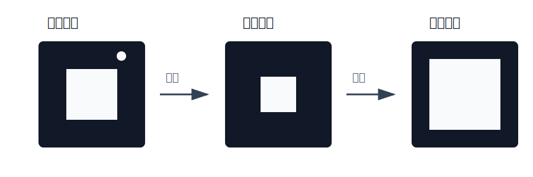
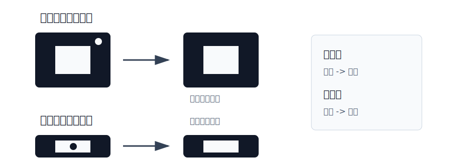

# 腐蚀、膨胀与形态学运算

形态学操作主要用于处理图像中的形状结构，常见于二值图像处理，也可以用于灰度图。

本节主要包括：

- **腐蚀**：缩小前景区域；
- **膨胀**：扩大前景区域；
- **开运算**：先腐蚀，再膨胀；
- **闭运算**：先膨胀，再腐蚀；
- **形态学梯度**：突出目标边缘；
- **礼帽和黑帽**：提取局部亮细节或暗细节。

**在二值图像中，通常把白色区域看作前景，黑色区域看作背景。**

## 核心知识点

| 操作 | 基本公式 | 主要作用 |
| --- | --- | --- |
| 腐蚀 | $I \ominus K$ | 缩小前景，去除小白点 |
| 膨胀 | $I \oplus K$ | 扩大前景，连接断裂区域 |
| 开运算 | $(I \ominus K) \oplus K$ | 去除小白点噪声 |
| 闭运算 | $(I \oplus K) \ominus K$ | 填补小黑洞 |
| 形态学梯度 | $(I \oplus K) - (I \ominus K)$ | 提取边缘轮廓 |
| 礼帽 | $I - \mathrm{Open}(I)$ | 提取局部亮细节 |
| 黑帽 | $\mathrm{Close}(I) - I$ | 提取局部暗细节 |

# 结构元素

结构元素也叫卷积核，是形态学操作中的小窗口。它会在图像上逐像素滑动，并根据窗口覆盖区域决定当前像素的新值。

常见的 `3 x 3` 矩形结构元素为：

$$
K =
\begin{bmatrix}
1 & 1 & 1 \\
1 & 1 & 1 \\
1 & 1 & 1
\end{bmatrix}
$$

**结构元素越大，形态学操作的效果越明显，但也越容易破坏目标细节。**

# 腐蚀

腐蚀会让前景区域变小。结构元素在图像上滑动时，只有**当覆盖区域内的像素都属于前景，中心像素才保留为前景**；否则会变为背景。

**腐蚀可以去除小白点噪声，也可以断开细小连接。**



```python
erosion = cv2.erode(img, kernel, iterations=1)
```

参数说明：

- `img`：输入图像；
- `kernel`：结构元素；
- `iterations`：迭代次数，次数越多，腐蚀越明显。

腐蚀的常见效果：

- 前景目标变小；
- 边界向内收缩；
- 小白点噪声被去掉；
- 细小连接可能被断开。

# 膨胀

膨胀会让前景区域变大。**结构元素在图像上滑动时，只要覆盖区域内存在前景像素，中心像素就会变为前景**。

**膨胀可以填补小黑洞，也可以连接断裂的前景区域。**

```python
dilation = cv2.dilate(img, kernel, iterations=1)
```

膨胀的常见效果：

- 前景目标变大；
- 边界向外扩张；
- 小黑洞可能被填补；
- 断裂区域可能被连接；
- 相邻目标也可能粘连在一起。

# 开运算

开运算是先腐蚀，再膨胀。

$$
\mathrm{Open}(I) = (I \ominus K) \oplus K
$$

腐蚀先去除小白点噪声，膨胀再尽量恢复目标大小。

**开运算常用于去除小白点噪声，同时尽量保留主体结构。**



```python
opening = cv2.morphologyEx(img, cv2.MORPH_OPEN, kernel)
```

适用场景：

- 去除小的白色噪声；
- 断开细小连接；
- 平滑目标外边界。

# 闭运算

闭运算是先膨胀，再腐蚀。

$$
\mathrm{Close}(I) = (I \oplus K) \ominus K
$$

膨胀先填补小黑洞或连接断裂区域，腐蚀再尽量恢复目标大小。

**闭运算常用于填补小黑洞、连接断裂区域。**

```python
closing = cv2.morphologyEx(img, cv2.MORPH_CLOSE, kernel)
```

适用场景：

- 填补前景内部的小黑洞；
- 连接断裂的前景区域；
- 平滑目标轮廓。

# 形态学梯度

形态学梯度是膨胀结果减去腐蚀结果。

$$
G = (I \oplus K) - (I \ominus K)
$$

膨胀会扩大目标，腐蚀会缩小目标，两者相减后，剩下的主要是目标边界区域。

**形态学梯度常用于提取目标轮廓和边缘。**

```python
gradient = cv2.morphologyEx(img, cv2.MORPH_GRADIENT, kernel)
```

等价理解：

```python
dilation = cv2.dilate(img, kernel, iterations=1)
erosion = cv2.erode(img, kernel, iterations=1)
gradient = cv2.subtract(dilation, erosion)
```

# 礼帽

礼帽运算是原图减去开运算结果。

$$
T = I - \mathrm{Open}(I)
$$

开运算会去掉小的亮区域，因此原图减去开运算结果后，剩下的就是这些局部亮细节。

**礼帽常用于提取小白点、亮斑、亮纹理等局部亮目标。**

```python
tophat = cv2.morphologyEx(img, cv2.MORPH_TOPHAT, kernel)
```

常见用途：

- 提取亮的小目标；
- 增强局部亮细节；
- 校正不均匀光照中的亮斑。

# 黑帽

黑帽运算是闭运算结果减去原图。

$$
B = \mathrm{Close}(I) - I
$$

闭运算会填补小的暗区域，因此闭运算结果减去原图后，剩下的就是这些局部暗细节。

**黑帽常用于提取小黑点、裂缝、暗纹理等局部暗目标。**

```python
blackhat = cv2.morphologyEx(img, cv2.MORPH_BLACKHAT, kernel)
```

常见用途：

- 提取暗的小目标；
- 增强局部暗细节；
- 检测裂缝、小黑洞或暗纹理。

# 常见形态学操作对比

| 操作 | 顺序或公式 | 效果 | 常见用途 |
| --- | --- | --- | --- |
| 腐蚀 | $I \ominus K$ | 前景变小 | 去小白点、断开细连接 |
| 膨胀 | $I \oplus K$ | 前景变大 | 填小黑洞、连接断裂区域 |
| 开运算 | 先腐蚀，再膨胀 | 去除小白点 | 去噪、平滑边界 |
| 闭运算 | 先膨胀，再腐蚀 | 填补小黑洞 | 补洞、连接目标 |
| 形态学梯度 | 膨胀减腐蚀 | 保留边缘 | 轮廓提取 |
| 礼帽 | 原图减开运算 | 保留亮细节 | 提取亮斑、小白点 |
| 黑帽 | 闭运算减原图 | 保留暗细节 | 提取裂缝、小黑点 |

# 本节总结

- **腐蚀会缩小前景，膨胀会扩大前景。**
- **开运算等于先腐蚀再膨胀，主要用于去除小白点噪声。**
- **闭运算等于先膨胀再腐蚀，主要用于填补小黑洞。**
- **形态学梯度等于膨胀减腐蚀，常用于提取边缘。**
- **礼帽用于提取局部亮细节，黑帽用于提取局部暗细节。**
- **结构元素大小和迭代次数会直接影响处理强度。**
