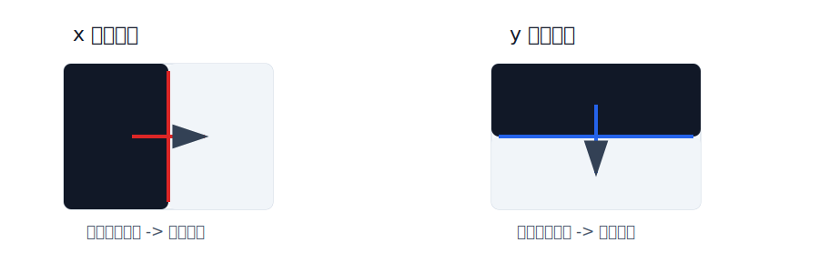

# Sobel、Scharr 与 Laplacian 算子

Sobel、Scharr 和 Laplacian 都是常见的边缘检测算子。它们的核心思想都是利用图像灰度变化来寻找边缘。

**边缘通常出现在灰度值变化剧烈的位置，例如物体轮廓、黑白交界处、纹理突变处。**

## 核心知识点

| 算子 | 导数阶数 | 主要思想 | 特点 |
| --- | --- | --- | --- |
| Sobel | 一阶导数 | 分别计算 x、y 方向梯度 | 常用、稳定，有一定平滑效果 |
| Scharr | 一阶导数 | Sobel 的 3 x 3 改进版本 | 方向响应更均衡，斜边缘更准确 |
| Laplacian | 二阶导数 | 计算整体二阶灰度变化 | 不区分方向，但对噪声敏感 |



# Sobel 算子

Sobel 算子是一种 **一阶梯度边缘检测算子**。它分别计算图像在水平方向和垂直方向上的灰度变化。

**Sobel_x 主要检测垂直边缘，Sobel_y 主要检测水平边缘。**

## Sobel 卷积核

x 方向卷积核：

$$
G_x =
\begin{bmatrix}
-1 & 0 & 1 \\
-2 & 0 & 2 \\
-1 & 0 & 1
\end{bmatrix}
* A
$$

y 方向卷积核：

$$
G_y =
\begin{bmatrix}
-1 & -2 & -1 \\
0 & 0 & 0 \\
1 & 2 & 1
\end{bmatrix}
* A
$$

其中：

- $A$：输入图像；
- $G_x$：x 方向梯度，反映左右灰度变化；
- $G_y$：y 方向梯度，反映上下灰度变化。

边缘强度通常可以由两个方向的梯度合成：

$$
G = \sqrt{G_x^2 + G_y^2}
$$

在实际代码中，也常用加权融合近似：

$$
G \approx 0.5|G_x| + 0.5|G_y|
$$

## 梯度计算过程

梯度计算本质上是 **卷积核在图像上滑动，对局部窗口做加权求和**。

以 Sobel_x 为例，它会取图像中的一个 `3 x 3` 局部窗口，与 x 方向卷积核逐元素相乘，然后把结果相加，得到该位置的 x 方向梯度。

假设某个局部窗口为：

$$
P =
\begin{bmatrix}
20 & 20 & 200 \\
20 & 20 & 200 \\
20 & 20 & 200
\end{bmatrix}
$$

这个窗口左侧较暗、右侧较亮，说明这里可能存在一条 **垂直边缘**。

使用 Sobel_x 计算：

$$
G_x =
\begin{bmatrix}
-1 & 0 & 1 \\
-2 & 0 & 2 \\
-1 & 0 & 1
\end{bmatrix}
*
\begin{bmatrix}
20 & 20 & 200 \\
20 & 20 & 200 \\
20 & 20 & 200
\end{bmatrix}
$$

逐元素相乘并求和：

$$
G_x =
(-1 \times 20 + 0 \times 20 + 1 \times 200)
+
(-2 \times 20 + 0 \times 20 + 2 \times 200)
+
(-1 \times 20 + 0 \times 20 + 1 \times 200)
= 720
$$

再用 Sobel_y 计算同一个窗口：

$$
G_y =
(-1 \times 20 - 2 \times 20 - 1 \times 200)
+
(1 \times 20 + 2 \times 20 + 1 \times 200)
= 0
$$

这个结果说明：

- $G_x$ 很大：左右方向灰度变化明显；
- $G_y$ 接近 0：上下方向灰度变化不明显；
- 因此该位置更可能是一条 **垂直边缘**。

**梯度值的绝对值越大，说明灰度变化越剧烈，越可能是边缘。**

实际计算时需要注意：

1. **梯度有正负号**：正负号表示灰度变化方向，例如从暗到亮或从亮到暗；
2. **显示边缘图时通常只关心强度**，所以会使用 `cv2.convertScaleAbs()` 转为绝对值图像；
3. **单独的 `Gx` 或 `Gy` 只能检测一个主要方向**，完整边缘通常要把两个方向合并；
4. **噪声也会产生剧烈灰度变化**，所以边缘检测前常先做高斯滤波。

## OpenCV Sobel

```python
dst = cv2.Sobel(src, ddepth, dx, dy, ksize)
```

参数说明：

| 参数 | 含义 |
| --- | --- |
| `src` | 输入图像，通常是灰度图 |
| `ddepth` | 输出图像深度，常用 `cv2.CV_64F` |
| `dx` | x 方向导数阶数，`1` 表示计算 x 方向梯度 |
| `dy` | y 方向导数阶数，`1` 表示计算 y 方向梯度 |
| `ksize` | Sobel 卷积核大小，通常为 `3`、`5`、`7` |

示例：

```python
import cv2

# 读取灰度图，梯度计算通常基于单通道图像
img = cv2.imread("test.jpg", cv2.IMREAD_GRAYSCALE)

# 计算 x 方向梯度，主要检测垂直边缘
sobel_x = cv2.Sobel(img, cv2.CV_64F, 1, 0, ksize=3)

# 计算 y 方向梯度，主要检测水平边缘
sobel_y = cv2.Sobel(img, cv2.CV_64F, 0, 1, ksize=3)

# 转换为可显示的 8 位图像
sobel_x = cv2.convertScaleAbs(sobel_x)
sobel_y = cv2.convertScaleAbs(sobel_y)

# 合并两个方向的边缘
sobel = cv2.addWeighted(sobel_x, 0.5, sobel_y, 0.5, 0)
```

**使用 `cv2.CV_64F` 是为了保留负梯度，最后再用 `cv2.convertScaleAbs()` 转换为可显示图像。**

# Scharr 算子

Scharr 算子可以看作 Sobel 算子的改进形式。它同样计算 x 和 y 方向的一阶梯度。

**在 `3 x 3` 卷积核下，Scharr 的方向响应比 Sobel 更均衡，更适合检测斜边缘。**

## Scharr 卷积核

x 方向卷积核：

$$
G_x =
\begin{bmatrix}
-3 & 0 & 3 \\
-10 & 0 & 10 \\
-3 & 0 & 3
\end{bmatrix}
* A
$$

y 方向卷积核：

$$
G_y =
\begin{bmatrix}
-3 & -10 & -3 \\
0 & 0 & 0 \\
3 & 10 & 3
\end{bmatrix}
* A
$$

Scharr 的权重更大，对灰度变化的响应更强。

```python
import cv2

# 读取灰度图
img = cv2.imread("test.jpg", cv2.IMREAD_GRAYSCALE)

# Scharr 不需要设置 ksize，内部使用优化后的 3 x 3 核
scharr_x = cv2.Scharr(img, cv2.CV_64F, 1, 0)
scharr_y = cv2.Scharr(img, cv2.CV_64F, 0, 1)

# 转为绝对值图像，便于显示边缘强度
scharr_x = cv2.convertScaleAbs(scharr_x)
scharr_y = cv2.convertScaleAbs(scharr_y)

# 将 x、y 两个方向的边缘响应合并
scharr = cv2.addWeighted(scharr_x, 0.5, scharr_y, 0.5, 0)
```

注意：

- `cv2.Scharr()` 不需要设置 `ksize`；
- Scharr 可以理解为固定使用优化后的 `3 x 3` 卷积核；
- 如果只做普通边缘检测，Sobel 通常已经够用；如果更关注小尺寸核下的方向精度，可以使用 Scharr。

# Laplacian 算子

Laplacian 算子使用 **二阶导数** 检测灰度突变区域。

一阶导数关注灰度变化速度，二阶导数关注灰度变化速度本身的变化。边缘附近常出现二阶导数的正负变化，也就是零交叉。

**Laplacian 不需要分别计算 x 和 y 方向，它会直接响应各个方向的边缘。**

## Laplacian 数学形式

二维图像 $f(x, y)$ 的 Laplacian 定义为：

$$
\nabla^2 f =
\frac{\partial^2 f}{\partial x^2}
+
\frac{\partial^2 f}{\partial y^2}
$$

常见的 `3 x 3` Laplacian 卷积核有两种。

4 邻域形式：

$$
\begin{bmatrix}
0 & 1 & 0 \\
1 & -4 & 1 \\
0 & 1 & 0
\end{bmatrix}
$$

8 邻域形式：

$$
\begin{bmatrix}
1 & 1 & 1 \\
1 & -8 & 1 \\
1 & 1 & 1
\end{bmatrix}
$$

**8 邻域形式考虑更多方向，边缘响应更强，但也更容易放大噪声。**

## OpenCV Laplacian

```python
dst = cv2.Laplacian(src, ddepth, ksize)
```

参数说明：

| 参数 | 含义 |
| --- | --- |
| `src` | 输入图像，通常是灰度图 |
| `ddepth` | 输出图像深度，常用 `cv2.CV_64F` |
| `ksize` | 卷积核大小，必须是正奇数 |

示例：

```python
import cv2

# 读取灰度图
img = cv2.imread("test.jpg", cv2.IMREAD_GRAYSCALE)

# Laplacian 对噪声敏感，通常先做高斯滤波
blur = cv2.GaussianBlur(img, (3, 3), 0)

# 计算二阶导数，响应灰度突变位置
laplacian = cv2.Laplacian(blur, cv2.CV_64F, ksize=3)

# 转换为 8 位绝对值图像，便于显示
laplacian = cv2.convertScaleAbs(laplacian)
```

**Laplacian 对噪声更敏感，实际使用时通常先进行高斯滤波。**

# 三种算子对比

| 算子 | 计算方式 | 优点 | 缺点 | 适用场景 |
| --- | --- | --- | --- | --- |
| Sobel | 分别计算 x、y 一阶梯度 | 稳定、常用、有一定抗噪能力 | 小尺寸核下方向精度一般 | 常规边缘检测 |
| Scharr | 优化后的 3 x 3 一阶梯度 | 方向响应更均衡 | 响应更强，可能更敏感 | 斜边缘、小核梯度检测 |
| Laplacian | 计算二阶导数 | 不区分方向，可检测多方向边缘 | 对噪声敏感 | 灰度突变明显的边缘检测 |

# 本节总结

- **Sobel 和 Scharr 都是一阶梯度算子，需要分别计算 x 和 y 方向。**
- **Sobel_x 主要检测垂直边缘，Sobel_y 主要检测水平边缘。**
- **Scharr 是 Sobel 在 `3 x 3` 核下的改进版本，方向响应更均衡。**
- **Laplacian 是二阶导数算子，可以同时响应多个方向的边缘。**
- **边缘检测前适当平滑可以减少噪声干扰。**
- **计算梯度时常用 `cv2.CV_64F` 保留负值，再用 `cv2.convertScaleAbs()` 转换显示。**
- **梯度计算的实际过程是局部窗口与卷积核逐元素相乘，再把结果求和。**
