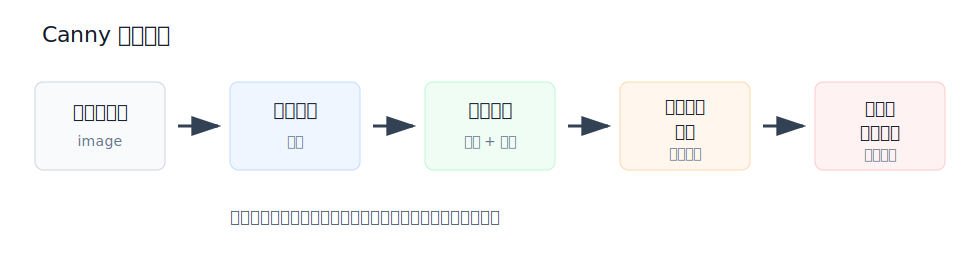
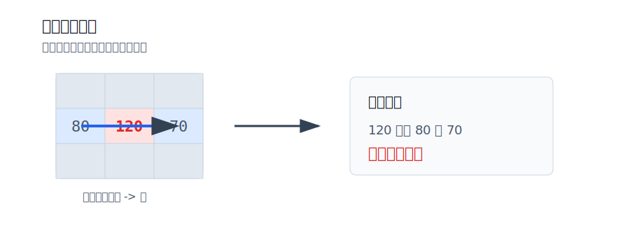

# Canny 边缘检测流程

Canny 边缘检测是一种经典的多阶段边缘检测算法。它不是简单地做一次卷积，而是把 **去噪、梯度计算、边缘细化、双阈值筛选和边缘连接** 组合起来，最终得到比较细、连续、干净的边缘。

**Canny 的目标是：尽量找到真实边缘，同时减少噪声边缘，并让边缘尽可能细。**

## 核心流程

| 步骤 | 作用 | 重点 |
| --- | --- | --- |
| 1. 高斯滤波去噪 | 平滑图像，减少噪声干扰 | **边缘检测对噪声非常敏感** |
| 2. 计算梯度 | 计算边缘强度和方向 | 得到梯度幅值 $G$ 和梯度方向 $\theta$ |
| 3. 非极大值抑制 | 保留梯度方向上的局部最大值 | **把粗边缘细化成单像素边缘** |
| 4. 双阈值检测 | 区分强边缘、弱边缘、非边缘 | 使用低阈值和高阈值 |
| 5. 滞后边缘连接 | 判断弱边缘是否保留 | **只保留与强边缘连通的弱边缘** |



# 1. 高斯滤波去噪

图像中的噪声也会造成灰度突变。如果不先去噪，Canny 很容易把噪声点误认为边缘。

因此 Canny 的第一步通常是使用高斯滤波对图像进行平滑处理。

```python
# Canny 前先平滑，降低噪声造成的伪边缘
blur = cv2.GaussianBlur(img, (5, 5), 0)
```

**高斯核越大，去噪越明显，但细小边缘也越容易被模糊掉。**

实际理解：

- 核较小：保留细节更多，但噪声也可能更多；
- 核较大：边缘更干净，但细节可能损失。

# 2. 计算图像梯度

去噪后，Canny 会使用 Sobel 算子分别计算 x 方向和 y 方向的梯度。

$$
G = \sqrt{G_x^2 + G_y^2}
$$

$$
\theta = \arctan\left(\frac{G_y}{G_x}\right)
$$

其中：

- $G_x$：x 方向梯度，表示左右方向灰度变化；
- $G_y$：y 方向梯度，表示上下方向灰度变化；
- $G$：梯度幅值，表示边缘强度；
- $\theta$：梯度方向，表示灰度变化最剧烈的方向。

**梯度幅值越大，说明灰度变化越剧烈，该位置越可能是边缘。**

需要注意：

**梯度方向与边缘方向是垂直的。**  
例如，一条垂直边缘的灰度变化主要发生在水平方向，所以它的梯度方向接近水平方向。

# 3. 非极大值抑制

梯度计算后，边缘通常还是比较粗的。因为边缘附近一整片区域都可能有较大的梯度值。

非极大值抑制的作用是：

**沿梯度方向比较当前像素和前后两个像素，只保留局部最大值。**

判断规则：

- 如果当前像素的梯度幅值大于梯度方向上的前后两个像素，就保留；
- 如果当前像素不是最大值，就置为 `0`；
- 这样可以把粗边缘压缩成更细的边缘线。



## 为什么沿梯度方向比较

**梯度方向表示灰度变化最快的方向，而边缘方向与梯度方向垂直。**

例如：

- 垂直边缘的灰度主要在水平方向发生变化；
- 所以判断它是不是边缘中心时，应该比较左右方向的梯度幅值；
- 如果当前点比左右两侧都大，说明它更可能是真正边缘中心；
- 如果旁边点更大，当前点就应该被抑制。

**非极大值抑制不是随便比较周围 8 个像素，而是沿梯度方向比较。**

## 梯度方向量化

实际计算中，梯度方向可能是任意角度。为了方便比较，Canny 通常把方向近似划分为 4 类。

| 梯度方向 | 比较的相邻像素 | 说明 |
| --- | --- | --- |
| 0° | 左、右 | 灰度主要在水平方向变化 |
| 45° | 左下、右上 | 灰度主要在 45° 方向变化 |
| 90° | 上、下 | 灰度主要在垂直方向变化 |
| 135° | 左上、右下 | 灰度主要在 135° 方向变化 |

# 4. 双阈值检测

非极大值抑制之后，Canny 会使用两个阈值继续筛选边缘。

- `threshold2`：高阈值；
- `threshold1`：低阈值。

判断规则：

| 梯度幅值范围 | 类型 | 处理方式 |
| --- | --- | --- |
| $G \geq threshold2$ | 强边缘 | 直接保留 |
| $G < threshold1$ | 非边缘 | 直接舍弃 |
| $threshold1 \leq G < threshold2$ | 弱边缘 | 暂时保留，等待连通性判断 |

**双阈值比单阈值更灵活，可以在保留真实边缘的同时减少噪声干扰。**

弱边缘不一定都是真边缘。Canny 会继续判断弱边缘是否和强边缘连通。

判断规则：

- **弱边缘与强边缘连通：保留；**
- **弱边缘孤立存在：舍弃。**

这样可以保留真实边缘上的连续弱响应，同时去掉孤立噪声点。

简单理解：

**强边缘是可靠边缘，弱边缘只有接在强边缘上才可信。**

# OpenCV 中的 Canny 函数

```python
# threshold1 是低阈值，threshold2 是高阈值
# apertureSize 控制内部 Sobel 算子的核大小
edges = cv2.Canny(image, threshold1, threshold2, apertureSize=3, L2gradient=False)
```

参数说明：

| 参数 | 含义 |
| --- | --- |
| `image` | 输入图像，通常是灰度图 |
| `threshold1` | 低阈值 |
| `threshold2` | 高阈值 |
| `apertureSize` | Sobel 算子的卷积核大小，默认是 `3` |
| `L2gradient` | 是否使用更精确的梯度幅值计算方式 |

示例代码：

```python
import cv2

# 读取灰度图，Canny 通常输入单通道图像
img = cv2.imread("test.jpg", cv2.IMREAD_GRAYSCALE)

# Canny 内部会完成梯度计算、非极大值抑制、双阈值检测和边缘连接
edges = cv2.Canny(img, 100, 200)
```

如果希望先手动去噪，也可以这样写：

```python
# 先去噪，再做 Canny，边缘结果通常更干净
blur = cv2.GaussianBlur(img, (5, 5), 0)
edges = cv2.Canny(blur, 100, 200)
```

# 阈值选择

阈值选择会明显影响检测结果。

| 阈值情况 | 结果 |
| --- | --- |
| 阈值太低 | 边缘多，但噪声也多 |
| 阈值太高 | 噪声少，但容易丢失真实边缘 |

常见取值：

```python
# 阈值较低：边缘更多，但噪声也更多
edges1 = cv2.Canny(img, 50, 150)

# 阈值较高：边缘更少，更容易丢失弱边缘
edges2 = cv2.Canny(img, 100, 200)
```

**低阈值控制弱边缘的保留范围，高阈值控制强边缘的可靠程度。**

# 本节总结

- **Canny 是多阶段边缘检测算法，不是单一卷积操作。**
- **高斯滤波用于减少噪声，避免产生伪边缘。**
- **梯度幅值表示边缘强度，梯度方向用于后续非极大值抑制。**
- **非极大值抑制用于细化边缘，只保留梯度方向上的局部最大值。**
- **双阈值把像素分为强边缘、弱边缘和非边缘。**
- **滞后边缘连接只保留与强边缘连通的弱边缘。**
- **阈值越低，边缘越多但噪声也越多；阈值越高，边缘更少但可能丢失细节。**
