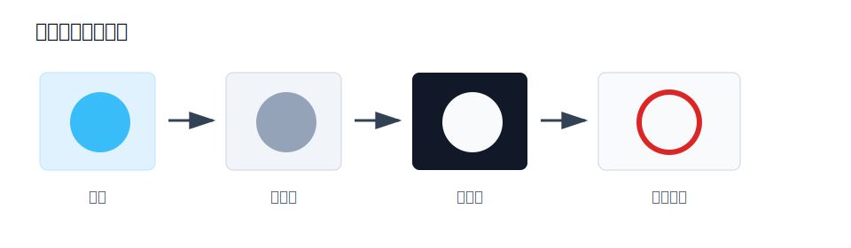
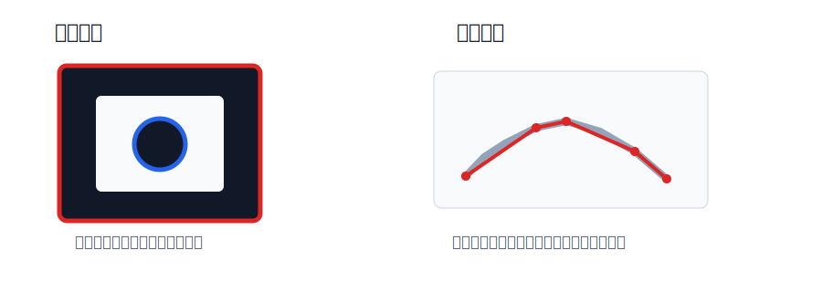

# 图像金字塔、轮廓检测与模板匹配

本节主要包含三类常用图像处理方法：

- **轮廓检测**：从二值图像中提取物体边界；
- **模板匹配**：在大图中寻找与模板最相似的位置；
- **图像金字塔**：构建不同尺度的图像，用于多尺度分析。

**轮廓检测关注形状边界，模板匹配关注局部相似度，图像金字塔关注尺度变化。**

## 核心知识点

| 模块 | 作用 | 常用函数 |
| --- | --- | --- |
| 轮廓检测 | 提取目标外边界或内部边界 | `cv2.findContours()`、`cv2.drawContours()` |
| 轮廓特征 | 计算面积、周长、外接矩形等 | `cv2.contourArea()`、`cv2.arcLength()`、`cv2.boundingRect()` |
| 模板匹配 | 在原图中寻找模板位置 | `cv2.matchTemplate()`、`cv2.minMaxLoc()` |
| 高斯金字塔 | 构建逐层缩小的图像 | `cv2.pyrDown()`、`cv2.pyrUp()` |
| 拉普拉斯金字塔 | 保存不同尺度之间的细节差异 | `cv2.subtract()` |

# 轮廓检测

轮廓检测用于提取图像中物体的外部边界或内部边界。OpenCV 中的轮廓通常是一组连续的点，可以用于目标定位、形状分析、面积计算、周长计算和外接矩形提取。

**轮廓检测通常基于二值图像，二值化效果会直接影响轮廓结果。**



## 基本流程

| 步骤 | 作用 | 常用函数 |
| --- | --- | --- |
| 1. 读取图像 | 获取原始图像 | `cv2.imread()` |
| 2. 转换灰度图 | 降低通道复杂度 | `cv2.cvtColor()` |
| 3. 二值化或边缘检测 | 分离目标和背景 | `cv2.threshold()`、`cv2.Canny()` |
| 4. 查找轮廓 | 提取边界点 | `cv2.findContours()` |
| 5. 绘制轮廓 | 显示检测结果 | `cv2.drawContours()` |
| 6. 分析轮廓 | 计算面积、周长、外接矩形等 | `cv2.contourArea()`、`cv2.arcLength()` |

示例代码：

```python
import cv2

img = cv2.imread("test.jpg")
gray = cv2.cvtColor(img, cv2.COLOR_BGR2GRAY)

# 二值化，也可以改用 Canny 边缘检测
ret, thresh = cv2.threshold(gray, 127, 255, cv2.THRESH_BINARY)

contours, hierarchy = cv2.findContours(
    thresh,
    cv2.RETR_TREE,
    cv2.CHAIN_APPROX_SIMPLE
)

result = img.copy()
cv2.drawContours(result, contours, -1, (0, 0, 255), 2)
```

## cv2.findContours

```python
contours, hierarchy = cv2.findContours(image, mode, method)
```

参数说明：

| 参数 | 含义 |
| --- | --- |
| `image` | 输入图像，必须是二值图或边缘图 |
| `mode` | 轮廓检索模式，控制是否保留层级关系 |
| `method` | 轮廓近似方法，控制轮廓点保存方式 |

返回值：

- `contours`：检测到的轮廓列表，每个轮廓是一组点坐标；
- `hierarchy`：轮廓层级关系，表示轮廓之间是否有父子嵌套关系。

**如果还需要保留原始二值图，可以传入 `thresh.copy()`。**

```python
contours, hierarchy = cv2.findContours(
    thresh.copy(),
    cv2.RETR_TREE,
    cv2.CHAIN_APPROX_SIMPLE
)
```

### 轮廓检索模式

`mode` 决定 OpenCV 如何查找和组织轮廓。

| 模式 | 含义 | 适用场景 |
| --- | --- | --- |
| `cv2.RETR_EXTERNAL` | 只检测最外层轮廓 | 只关心外边界 |
| `cv2.RETR_LIST` | 检测所有轮廓，但不建立层级关系 | 只需要轮廓点 |
| `cv2.RETR_CCOMP` | 检测所有轮廓，并组织成两层结构 | 区分外轮廓和内部孔洞 |
| `cv2.RETR_TREE` | 检测所有轮廓，并建立完整层级树 | 分析嵌套轮廓 |

**只关心外边界时用 `RETR_EXTERNAL`，需要完整嵌套关系时用 `RETR_TREE`。**

### 轮廓近似方法

`method` 决定轮廓点如何保存。

| 方法 | 含义 | 特点 |
| --- | --- | --- |
| `cv2.CHAIN_APPROX_NONE` | 保存轮廓上的所有点 | 点数多，占用空间大 |
| `cv2.CHAIN_APPROX_SIMPLE` | 压缩冗余点 | 点数少，更常用 |

例如矩形轮廓：

- `CHAIN_APPROX_NONE` 会保存边界上的大量点；
- `CHAIN_APPROX_SIMPLE` 通常只保留关键角点。



## 绘制轮廓

```python
cv2.drawContours(image, contours, contourIdx, color, thickness)
```

常用写法：

```python
# 绘制所有轮廓
cv2.drawContours(img, contours, -1, (0, 255, 0), 2)

# 绘制第 0 个轮廓
cv2.drawContours(img, contours, 0, (0, 0, 255), 2)

# 填充轮廓
cv2.drawContours(img, contours, -1, (255, 0, 0), -1)
```

## 常用轮廓特征

检测到轮廓后，可以进一步计算轮廓特征。

| 特征 | 函数 | 用途 |
| --- | --- | --- |
| 面积 | `cv2.contourArea(cnt)` | 过滤小噪声轮廓 |
| 周长 | `cv2.arcLength(cnt, True)` | 分析边界长度 |
| 多边形近似 | `cv2.approxPolyDP()` | 判断形状 |
| 外接矩形 | `cv2.boundingRect(cnt)` | 目标定位 |
| 最小外接圆 | `cv2.minEnclosingCircle(cnt)` | 分析圆形目标 |
| 图像矩 | `cv2.moments(cnt)` | 计算重心 |

### 面积过滤

```python
for cnt in contours:
    area = cv2.contourArea(cnt)
    if area > 100:
        cv2.drawContours(img, [cnt], -1, (0, 255, 0), 2)
```

**面积过滤常用于去除小噪声轮廓。**

### 周长

```python
perimeter = cv2.arcLength(cnt, True)
```

参数 `True` 表示轮廓是闭合的。

### 多边形近似

```python
epsilon = 0.02 * cv2.arcLength(cnt, True)
approx = cv2.approxPolyDP(cnt, epsilon, True)
```

常见判断方式：

- 近似后有 3 个顶点：可能是三角形；
- 近似后有 4 个顶点：可能是矩形或正方形；
- 顶点数量较多：可能是圆形或复杂形状。

### 外接矩形

```python
x, y, w, h = cv2.boundingRect(cnt)
cv2.rectangle(img, (x, y), (x + w, y + h), (0, 255, 0), 2)
```

返回值分别表示左上角坐标、宽度和高度。

### 最小外接圆

```python
(x, y), radius = cv2.minEnclosingCircle(cnt)
center = (int(x), int(y))
radius = int(radius)
cv2.circle(img, center, radius, (255, 0, 0), 2)
```

### 图像矩和重心

```python
M = cv2.moments(cnt)

if M["m00"] != 0:
    cx = int(M["m10"] / M["m00"])
    cy = int(M["m01"] / M["m00"])
```

**计算重心时要判断 `M["m00"]` 是否为 0，避免除零错误。**

# 模板匹配

模板匹配用于在一张大图中寻找与给定小图最相似的区域。OpenCV 会让模板在原图上从左到右、从上到下滑动，并在每一个位置计算相似度。

**模板匹配适合目标外观固定、尺度和旋转变化不大的场景。**

## 基本流程

| 步骤 | 作用 | 常用函数 |
| --- | --- | --- |
| 1. 读取原图和模板 | 获取待搜索图像和模板 | `cv2.imread()` |
| 2. 转换灰度图 | 降低计算复杂度 | `cv2.cvtColor()` |
| 3. 模板滑动匹配 | 计算相似度 | `cv2.matchTemplate()` |
| 4. 寻找最优位置 | 找到最大值或最小值位置 | `cv2.minMaxLoc()` |
| 5. 绘制匹配区域 | 标记目标位置 | `cv2.rectangle()` |

## cv2.matchTemplate

```python
result = cv2.matchTemplate(image, templ, method)
```

如果原图大小为 `W x H`，模板大小为 `w x h`，结果矩阵大小为：

$$
(W - w + 1) \times (H - h + 1)
$$

**结果矩阵中的每一个值，表示模板左上角放在该位置时的匹配程度。**

### 常用匹配方法

| 方法 | 含义 | 最优位置 |
| --- | --- | --- |
| `cv2.TM_SQDIFF` | 平方差匹配，差异越小越相似 | 最小值 |
| `cv2.TM_SQDIFF_NORMED` | 归一化平方差匹配 | 最小值 |
| `cv2.TM_CCORR` | 相关匹配，相关性越大越相似 | 最大值 |
| `cv2.TM_CCORR_NORMED` | 归一化相关匹配 | 最大值 |
| `cv2.TM_CCOEFF` | 相关系数匹配，考虑均值差异 | 最大值 |
| `cv2.TM_CCOEFF_NORMED` | 归一化相关系数匹配 | 最大值 |

**`TM_SQDIFF` 类方法取最小值，其它方法通常取最大值。**

实际项目中常用：

```python
method = cv2.TM_CCOEFF_NORMED
```

## 单目标模板匹配

```python
import cv2

img = cv2.imread("image.jpg")
template = cv2.imread("template.jpg")

gray = cv2.cvtColor(img, cv2.COLOR_BGR2GRAY)
template_gray = cv2.cvtColor(template, cv2.COLOR_BGR2GRAY)

h, w = template_gray.shape[:2]

result = cv2.matchTemplate(gray, template_gray, cv2.TM_CCOEFF_NORMED)
min_val, max_val, min_loc, max_loc = cv2.minMaxLoc(result)

top_left = max_loc
bottom_right = (top_left[0] + w, top_left[1] + h)

cv2.rectangle(img, top_left, bottom_right, (0, 0, 255), 2)
```

## 多目标模板匹配

如果图像中可能存在多个相同目标，需要设置阈值，找出所有匹配程度较高的位置。

```python
import cv2
import numpy as np

img = cv2.imread("image.jpg")
template = cv2.imread("template.jpg")

gray = cv2.cvtColor(img, cv2.COLOR_BGR2GRAY)
template_gray = cv2.cvtColor(template, cv2.COLOR_BGR2GRAY)

h, w = template_gray.shape[:2]

result = cv2.matchTemplate(gray, template_gray, cv2.TM_CCOEFF_NORMED)

threshold = 0.8
locations = np.where(result >= threshold)

for pt in zip(*locations[::-1]):
    cv2.rectangle(img, pt, (pt[0] + w, pt[1] + h), (0, 255, 0), 2)
```

注意：

- `np.where(result >= threshold)` 找出所有高匹配位置；
- `locations[::-1]` 是把 NumPy 的行列坐标转换为 OpenCV 需要的 x、y 坐标；
- **阈值越高，匹配越严格；阈值越低，目标更多但误匹配也更多。**

# 图像金字塔

图像金字塔是同一张图像在不同分辨率下的一组表示。它把原图逐层缩小或放大，形成类似金字塔的结构。

**图像金字塔常用于多尺度处理，例如目标检测、模板匹配、图像融合和特征提取。**

## 高斯金字塔

高斯金字塔通过不断进行高斯平滑和下采样得到。

从底层到上层的过程叫 **下采样**，图像尺寸逐层变小：

```python
down = cv2.pyrDown(img)
```

`cv2.pyrDown()` 可以理解为：

1. **先进行高斯滤波，减少噪声和细节；**
2. **再删除部分行和列，使宽高约变为原来的一半；**
3. **得到更小一层的图像。**

从上层到下层的过程叫 **上采样**，图像尺寸逐层变大：

```python
up = cv2.pyrUp(img)
```

`cv2.pyrUp()` 可以理解为：

1. **先在图像行和列之间插入空值，使尺寸扩大；**
2. **再进行高斯滤波，让放大结果更平滑；**
3. **得到更大一层的图像。**

**上采样不能恢复下采样时丢失的真实细节。**

## 构建高斯金字塔

```python
import cv2

img = cv2.imread("test.jpg")

gaussian_pyramid = [img]

current = img
for i in range(3):
    current = cv2.pyrDown(current)
    gaussian_pyramid.append(current)
```

生成结果：

| 层级 | 图像来源 | 尺寸变化 |
| --- | --- | --- |
| 第 0 层 | 原图 | 原始尺寸 |
| 第 1 层 | `pyrDown()` 一次 | 约为原图的 1/2 |
| 第 2 层 | `pyrDown()` 两次 | 约为原图的 1/4 |
| 第 3 层 | `pyrDown()` 三次 | 约为原图的 1/8 |

## 拉普拉斯金字塔

拉普拉斯金字塔用于保存图像在不同尺度之间丢失的细节信息。它通常由高斯金字塔相邻两层计算得到。

假设高斯金字塔中有两层：

- 当前层：$G_i$
- 下一层：$G_{i+1}$

先把下一层上采样回当前层大小：

$$
\operatorname{Expand}(G_{i+1})
$$

再用当前层减去上采样结果：

$$
L_i = G_i - \operatorname{Expand}(G_{i+1})
$$

**$L_i$ 表示从当前层到下一层下采样过程中丢失的细节。**

构建代码：

```python
laplacian_pyramid = []

for i in range(len(gaussian_pyramid) - 1):
    current = gaussian_pyramid[i]
    next_img = gaussian_pyramid[i + 1]

    up = cv2.pyrUp(next_img)
    up = cv2.resize(up, (current.shape[1], current.shape[0]))

    laplacian = cv2.subtract(current, up)
    laplacian_pyramid.append(laplacian)
```

注意：

**做图像相减时，必须保证两张图像尺寸和通道数一致。**

## 多尺度模板匹配

图像金字塔可以和模板匹配结合使用，用来处理目标尺寸不固定的问题。

基本思路：

1. 对原图或模板构建图像金字塔；
2. 在不同尺度上进行模板匹配；
3. 记录每个尺度下的最佳匹配结果；
4. 选择匹配值最好的位置作为最终结果。

**多尺度模板匹配能提升尺度适应能力，但计算量也会增加。**

# 本节总结

- **轮廓检测通常基于二值图像，二值化质量决定轮廓质量。**
- **`RETR_EXTERNAL` 只保留外轮廓，`RETR_TREE` 保留完整嵌套关系。**
- **`CHAIN_APPROX_SIMPLE` 可以压缩冗余轮廓点，实际更常用。**
- **模板匹配适合目标外观固定、尺度和旋转变化不大的场景。**
- **`TM_SQDIFF` 类方法取最小值，其它模板匹配方法通常取最大值。**
- **高斯金字塔用于多尺度表示，拉普拉斯金字塔用于保存尺度差异细节。**
- **`pyrDown()` 会丢失细节，`pyrUp()` 不能恢复真实细节。**
