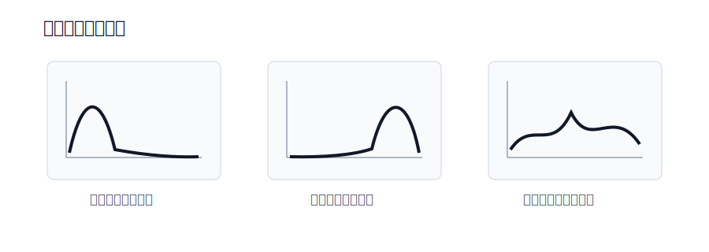
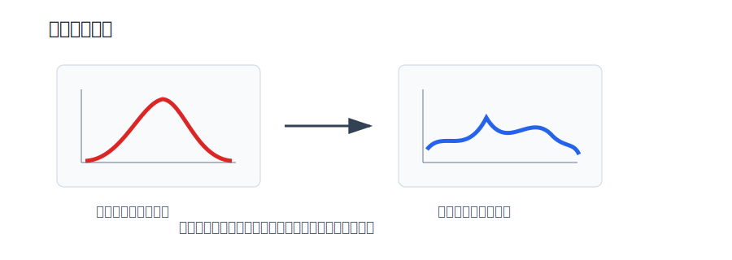
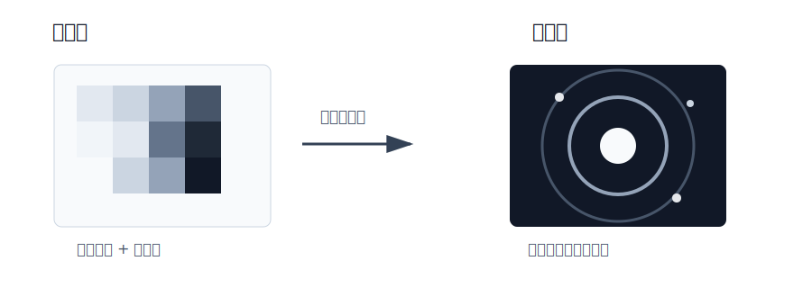

# 直方图与傅里叶变换

本节主要介绍两类常用图像分析方法：

- **直方图**：统计像素值分布，用于分析亮度、对比度和图像增强；
- **傅里叶变换**：把图像从空间域转换到频率域，用于分析低频、高频和频域滤波。

**直方图关注像素值分布，傅里叶变换关注灰度变化频率。**

## 核心知识点

| 模块 | 作用 | 常用函数 |
| --- | --- | --- |
| 灰度直方图 | 统计灰度值出现次数 | `cv2.calcHist()` |
| 直方图均衡化 | 增强图像对比度 | `cv2.equalizeHist()` |
| CLAHE | 局部自适应均衡化 | `cv2.createCLAHE()` |
| 傅里叶变换 | 空间域转频率域 | `cv2.dft()` |
| 频谱中心化 | 将低频移动到中心 | `np.fft.fftshift()` |
| 逆傅里叶变换 | 频率域转回空间域 | `cv2.idft()` |

# 图像直方图

图像直方图用于统计图像中不同像素值出现的次数或比例。对于灰度图来说，横轴表示灰度级，范围是 `0~255`；纵轴表示每个灰度值对应的像素数量。

**直方图可以反映图像的亮度分布和对比度情况。**



## 直方图怎么看

| 直方图分布 | 图像特点 |
| --- | --- |
| 像素集中在左侧 | 图像整体偏暗 |
| 像素集中在右侧 | 图像整体偏亮 |
| 像素分布范围窄 | 对比度较低 |
| 像素分布范围宽 | 对比度较高 |
| 像素分布较均匀 | 明暗层次通常更丰富 |

## 灰度直方图

灰度直方图统计的是单通道灰度图中每个灰度级出现的次数。

```python
# calcHist 的参数通常要用列表形式传入
hist = cv2.calcHist(images, channels, mask, histSize, ranges)
```

参数说明：

| 参数 | 含义 |
| --- | --- |
| `images` | 输入图像列表，例如 `[img]` |
| `channels` | 统计哪个通道，灰度图用 `[0]` |
| `mask` | 掩膜，统计整张图时写 `None` |
| `histSize` | 直方图区间数量，灰度图通常写 `[256]` |
| `ranges` | 像素统计范围，灰度图通常写 `[0, 256]` |

示例：

```python
import cv2
import matplotlib.pyplot as plt

# 读取灰度图，统计单通道灰度分布
img = cv2.imread("test.jpg", cv2.IMREAD_GRAYSCALE)

# 统计 0~255 每个灰度级出现的次数
hist = cv2.calcHist([img], [0], None, [256], [0, 256])

# 绘制直方图曲线
plt.plot(hist)
plt.xlim([0, 256])
plt.show()
```

**灰度直方图只统计像素值分布，不关心像素在图像中的空间位置。**

## 彩色图像直方图

彩色图像通常有 B、G、R 三个通道，可以分别统计每个通道的直方图。

```python
import cv2
import matplotlib.pyplot as plt

# OpenCV 默认读取为 BGR 彩色图
img = cv2.imread("test.jpg")

colors = ("b", "g", "r")
for i, color in enumerate(colors):
    # 分别统计 B、G、R 三个通道的直方图
    hist = cv2.calcHist([img], [i], None, [256], [0, 256])
    plt.plot(hist, color=color)
    plt.xlim([0, 256])

plt.show()
```

**OpenCV 读取彩色图像时默认通道顺序是 BGR，不是 RGB。**

## 使用掩膜统计局部直方图

如果只想统计图像中的某个区域，可以使用 `mask`。

```python
import cv2
import numpy as np

# 读取灰度图
img = cv2.imread("test.jpg", cv2.IMREAD_GRAYSCALE)

# 创建全黑掩膜，默认所有区域都不参与统计
mask = np.zeros(img.shape[:2], np.uint8)

# 将感兴趣区域设为 255，表示只统计该区域
mask[100:300, 100:300] = 255

hist = cv2.calcHist([img], [0], mask, [256], [0, 256])
```

**掩膜中值为 `255` 的区域参与统计，值为 `0` 的区域不参与统计。**

# 直方图均衡化

直方图均衡化是一种图像增强方法，主要用于提升图像对比度。

它的核心思想是：

**把原本集中在较窄灰度范围内的像素值，重新分布到更宽的灰度范围中，使图像明暗层次更明显。**



## 均衡化原理

直方图均衡化不是简单线性拉伸，而是根据灰度值的累计分布函数进行灰度映射。

基本流程：

| 步骤 | 作用 | 输出 |
| --- | --- | --- |
| 1. 统计直方图 | 计算每个灰度值出现次数 | 灰度分布 |
| 2. 计算概率分布 | 像素数除以总像素数 | 灰度概率 |
| 3. 计算累计分布函数 | 从低灰度到高灰度累加概率 | CDF |
| 4. 建立灰度映射 | 根据累计概率重新分配灰度值 | 新灰度表 |
| 5. 替换原像素值 | 使用新灰度表生成图像 | 均衡化图像 |

累计分布函数：

$$
CDF(k) = \sum_{i=0}^{k} p(i)
$$

均衡化后的灰度值：

$$
s_k = round((L - 1) \times CDF(k))
$$

其中：

- $p(i)$：灰度值 $i$ 出现的概率；
- $L$：灰度级数量，8 位图像中 $L = 256$；
- $s_k$：灰度值 $k$ 均衡化后的新灰度值。

## OpenCV 直方图均衡化

OpenCV 使用 `cv2.equalizeHist()` 对灰度图进行直方图均衡化。

```python
# 对 8 位单通道灰度图做全局直方图均衡化
dst = cv2.equalizeHist(src)
```

注意：

**`cv2.equalizeHist()` 的输入必须是 8 位单通道灰度图。**

示例：

```python
import cv2
import matplotlib.pyplot as plt

# 读取灰度图
img = cv2.imread("test.jpg", cv2.IMREAD_GRAYSCALE)

# 对整张图做全局直方图均衡化
equ = cv2.equalizeHist(img)

# 分别统计均衡化前后的直方图，便于对比
hist_img = cv2.calcHist([img], [0], None, [256], [0, 256])
hist_equ = cv2.calcHist([equ], [0], None, [256], [0, 256])

plt.subplot(121)
plt.plot(hist_img)
plt.title("Original")

plt.subplot(122)
plt.plot(hist_equ)
plt.title("Equalized")

plt.show()
```

## 彩色图像均衡化

不建议直接对 B、G、R 三个通道分别做均衡化，因为这样可能改变图像颜色。

**彩色图像更常见的做法是转换到 YCrCb 或 HSV，只对亮度通道做均衡化。**

```python
import cv2

img = cv2.imread("test.jpg")

# 转到 YCrCb，Y 通道表示亮度
ycrcb = cv2.cvtColor(img, cv2.COLOR_BGR2YCrCb)

# 只均衡化亮度通道，尽量避免颜色失真
ycrcb[:, :, 0] = cv2.equalizeHist(ycrcb[:, :, 0])

# 转回 BGR 用于显示或保存
result = cv2.cvtColor(ycrcb, cv2.COLOR_YCrCb2BGR)
```

## CLAHE

普通直方图均衡化是全局处理。如果图像中不同区域亮度差异很大，可能会出现局部过亮或噪声放大的问题。

CLAHE 是自适应直方图均衡化，它会把图像分成多个小块，在局部区域分别做均衡化，并通过限制对比度减少噪声放大。

```python
import cv2

img = cv2.imread("test.jpg", cv2.IMREAD_GRAYSCALE)

# 创建 CLAHE 对象：限制对比度，并按 8 x 8 小块做局部均衡
clahe = cv2.createCLAHE(clipLimit=2.0, tileGridSize=(8, 8))

# 应用 CLAHE 得到增强图像
result = clahe.apply(img)
```

参数说明：

- `clipLimit`：对比度限制阈值，值越大增强越明显，但噪声也可能越明显；
- `tileGridSize`：图像分块大小，例如 `(8, 8)` 表示分成 `8 x 8` 个小块。

**局部亮度差异明显时，CLAHE 通常比普通全局均衡化更稳。**

# 傅里叶变换

傅里叶变换用于把图像从 **空间域** 转换到 **频率域**。

在空间域中，图像可以理解为像素灰度值在二维平面上的分布；在频率域中，图像可以理解为由不同频率的波叠加而成。

**空间域关注像素位置和灰度值，频率域关注灰度变化的快慢。**



## 低频和高频

| 频率成分 | 含义 | 对应图像内容 |
| --- | --- | --- |
| 低频 | 灰度变化缓慢 | 背景、主体轮廓、大面积平滑区域 |
| 高频 | 灰度变化剧烈 | 边缘、细节、纹理、噪声 |

**保留低频可以实现平滑去噪，保留高频可以突出边缘和细节。**

傅里叶变换常用于图像滤波、图像去噪、边缘增强和频谱分析。

## 频率变换流程

1. 读取灰度图；
2. 使用 `cv2.dft()` 进行傅里叶变换；
3. 使用 `np.fft.fftshift()` 将低频移动到频谱中心；
4. 根据需要修改频率区域；
5. 使用 `np.fft.ifftshift()` 将频谱移回原位置；
6. 使用 `cv2.idft()` 做逆傅里叶变换；
7. 得到处理后的空间域图像。

### OpenCV 傅里叶变换

```python
# 对 float32 灰度图做 DFT，输出实部和虚部两个通道
dft = cv2.dft(src, flags=cv2.DFT_COMPLEX_OUTPUT)
```

参数说明：

| 参数 | 含义 |
| --- | --- |
| `src` | 输入灰度图，通常需要转换为 `float32` |
| `flags=cv2.DFT_COMPLEX_OUTPUT` | 输出复数结果，包含实部和虚部 |

傅里叶变换结果是复数，不能直接当普通图像显示。通常需要计算幅值谱：

```python
# 由实部和虚部计算频谱幅值
magnitude = cv2.magnitude(dft[:, :, 0], dft[:, :, 1])
```

由于频谱数值范围可能很大，显示时通常进行对数变换：

```python
# 对数变换压缩数值范围，便于显示频谱
magnitude_spectrum = 20 * np.log(magnitude + 1)
```

### 频谱中心化

傅里叶变换后，低频默认分布在频谱图四个角。为了更直观地观察和处理频谱，通常使用 `np.fft.fftshift()` 将低频移动到中心。

```python
# 将低频从四个角移动到频谱中心
dft_shift = np.fft.fftshift(dft)
```

中心化之后：

- **频谱中心是低频区域；**
- **远离中心的位置是高频区域。**

### 频率变换示例

```python
import cv2
import numpy as np
import matplotlib.pyplot as plt

# 读取灰度图并转换为 float32
img = cv2.imread("test.jpg", cv2.IMREAD_GRAYSCALE)
img_float = np.float32(img)

# 傅里叶变换，并将低频移动到中心
dft = cv2.dft(img_float, flags=cv2.DFT_COMPLEX_OUTPUT)
dft_shift = np.fft.fftshift(dft)

# 计算幅值谱，并做对数变换方便显示
magnitude = cv2.magnitude(dft_shift[:, :, 0], dft_shift[:, :, 1])
magnitude_spectrum = 20 * np.log(magnitude + 1)

plt.subplot(121)
plt.imshow(img, cmap="gray")
plt.title("Input Image")
plt.axis("off")

plt.subplot(122)
plt.imshow(magnitude_spectrum, cmap="gray")
plt.title("Magnitude Spectrum")
plt.axis("off")

plt.show()
```

### 逆傅里叶变换

如果在频率域中修改了图像，需要通过逆傅里叶变换回到空间域。

```python
# 先把中心化频谱移回原位置
f_ishift = np.fft.ifftshift(dft_shift)

# 逆傅里叶变换回空间域
img_back = cv2.idft(f_ishift)

# 逆变换结果仍是复数形式，需要计算幅值
img_back = cv2.magnitude(img_back[:, :, 0], img_back[:, :, 1])
```

注意：

- `np.fft.ifftshift()` 用于把频谱移回原位置；
- `cv2.idft()` 用于做逆傅里叶变换；
- `cv2.magnitude()` 用于把复数结果转换为幅值图像。

# 低通和高通滤波

傅里叶变换后，可以在频率域中通过掩膜保留或去除某些频率成分。

## 低通滤波

低通滤波会 **保留频谱中心的低频区域，去掉远离中心的高频区域**。

低频主要对应图像中的平滑区域和整体结构，所以低通滤波的效果通常是图像变模糊，同时可以减少噪声。

```python
import cv2
import numpy as np

# 读取灰度图并转换为 float32
img = cv2.imread("test.jpg", cv2.IMREAD_GRAYSCALE)
img_float = np.float32(img)

# 傅里叶变换，并把低频移到中心
dft = cv2.dft(img_float, flags=cv2.DFT_COMPLEX_OUTPUT)
dft_shift = np.fft.fftshift(dft)

# 找到频谱中心位置
rows, cols = img.shape
crow, ccol = rows // 2, cols // 2

# 创建低通掩膜：只保留中心低频区域
mask = np.zeros((rows, cols, 2), np.uint8)
mask[crow - 30:crow + 30, ccol - 30:ccol + 30] = 1

# 应用掩膜，过滤掉高频信息
fshift = dft_shift * mask

# 逆变换回空间域
f_ishift = np.fft.ifftshift(fshift)
img_back = cv2.idft(f_ishift)
img_back = cv2.magnitude(img_back[:, :, 0], img_back[:, :, 1])
```

低通滤波特点：

- 保留整体轮廓和大面积平滑区域；
- 去除边缘、纹理和噪声等高频信息；
- **结果图像会变模糊；**
- 中心保留区域越大，保留的细节越多。

## 高通滤波

高通滤波会 **去掉频谱中心的低频区域，保留远离中心的高频区域**。

高频主要对应图像中的边缘、纹理和细节，所以高通滤波可以突出边缘，但也可能增强噪声。

```python
import cv2
import numpy as np

# 读取灰度图并转换为 float32
img = cv2.imread("test.jpg", cv2.IMREAD_GRAYSCALE)
img_float = np.float32(img)

# 傅里叶变换，并把低频移到中心
dft = cv2.dft(img_float, flags=cv2.DFT_COMPLEX_OUTPUT)
dft_shift = np.fft.fftshift(dft)

# 找到频谱中心位置
rows, cols = img.shape
crow, ccol = rows // 2, cols // 2

# 创建高通掩膜：先全部保留
mask = np.ones((rows, cols, 2), np.uint8)

# 去掉中心低频区域，只保留远离中心的高频
mask[crow - 30:crow + 30, ccol - 30:ccol + 30] = 0

# 应用掩膜，突出高频信息
fshift = dft_shift * mask

# 逆变换回空间域
f_ishift = np.fft.ifftshift(fshift)
img_back = cv2.idft(f_ishift)
img_back = cv2.magnitude(img_back[:, :, 0], img_back[:, :, 1])
```

高通滤波特点：

- 保留边缘、纹理、细节等高频信息；
- 去除背景和大面积平滑区域；
- **可以用于边缘增强；**
- **容易放大噪声。**

## 低通和高通对比

| 滤波方式 | 保留内容 | 去除内容 | 图像效果 | 常见用途 |
| --- | --- | --- | --- | --- |
| 低通滤波 | 低频 | 高频 | 图像变平滑、变模糊 | 去噪、模糊处理 |
| 高通滤波 | 高频 | 低频 | 边缘和细节更明显 | 边缘增强、细节提取 |

# 本节总结

- **直方图用于分析像素值分布，可以判断亮度和对比度。**
- **直方图均衡化适合对比度较低、灰度集中明显的图像。**
- **彩色图像均衡化建议只处理亮度通道，避免颜色失真。**
- **CLAHE 适合局部亮度差异明显的图像。**
- **傅里叶变换把图像从空间域转换到频率域。**
- **频谱中心区域是低频，远离中心的位置是高频。**
- **低通滤波保留低频，图像会更平滑；高通滤波保留高频，边缘和细节更明显。**
- **理想矩形掩膜可能带来振铃效应，实际项目中可以使用更平滑的滤波器。**
