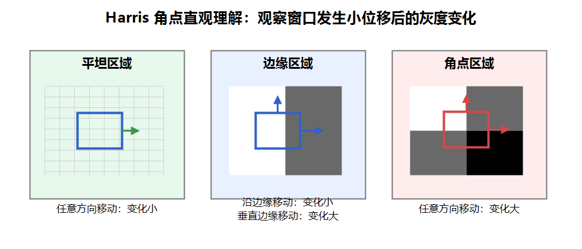
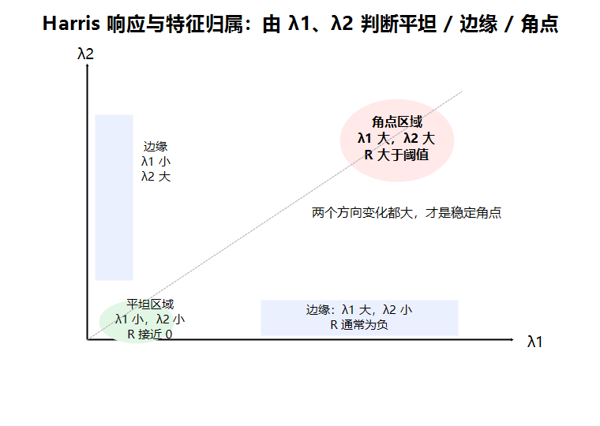
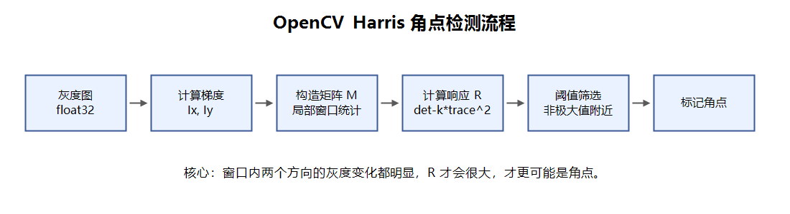

# 角点检测基本原理

Harris 角点检测用于在图像中寻找 **角点特征**。角点通常是图像中两个方向灰度变化都很明显的位置，例如物体拐角、棋盘格交点、窗口边角等。

在图像特征中，角点比单纯的边缘更稳定：

- 平坦区域：各个方向灰度变化都很小，不适合作为特征点；
- 边缘区域：沿边缘方向变化小，垂直边缘方向变化大，定位不够稳定；
- 角点区域：任意方向移动都会产生明显灰度变化，更适合作为特征点。



Harris 的核心思想是：取一个小窗口，观察这个窗口向不同方向移动时，窗口内灰度是否发生明显变化。

| 区域类型 | 窗口移动后的变化 | 判断结果 |
| --- | --- | --- |
| 平坦区域 | 任意方向移动，灰度变化都很小 | 不是特征点 |
| 边缘区域 | 某一个方向变化大，另一个方向变化小 | 边缘 |
| 角点区域 | 任意方向移动，灰度变化都很大 | 角点 |

# 基本数学原理

Harris 角点检测会计算窗口移动前后的灰度差异。假设窗口移动量为 $(u, v)$，则灰度变化可以表示为：

$$
E(u, v) = \sum_{x,y} w(x,y) [I(x+u, y+v) - I(x,y)]^2
$$

其中：

- $I(x,y)$：原图像在 $(x,y)$ 位置的灰度值；
- $I(x+u,y+v)$：窗口移动后的灰度值；
- $w(x,y)$：窗口权重，通常可以理解为窗口内每个像素的重要程度；
- $E(u,v)$：窗口移动后的灰度变化量。

**如果 $E(u,v)$ 在各个方向都很大，说明窗口无论怎么移动，灰度变化都很明显，这个位置就更可能是角点。**

## 结构张量矩阵

直接计算所有方向上的 $E(u,v)$ 比较麻烦，所以 Harris 使用**一阶泰勒展开**进行近似：

$$
I(x+u, y+v) \approx I(x,y) + I_x u + I_y v
$$

其中：

- $I_x$：x 方向梯度，$I(x,y)$对x求偏导；
- $I_y$：y 方向梯度，$I(x,y)$对y求偏导。

代入后可以得到：

$$
E(u,v) \approx
\begin{bmatrix}
u & v
\end{bmatrix}
M
\begin{bmatrix}
u \\
v
\end{bmatrix}
$$

其中 $M$ 是 Harris 矩阵，也叫结构张量矩阵：

$$
M =
\begin{bmatrix}
\sum I_x^2 & \sum I_x I_y \\
\sum I_x I_y & \sum I_y^2
\end{bmatrix}
$$

矩阵 $M$ 描述了窗口内 x 方向和 y 方向的灰度变化情况。

## Harris 响应函数

Harris 不直接计算矩阵 $M$ 的特征值，而是通过行列式和迹构造响应函数：

$$
R = det(M) - k(trace(M))^2
$$

其中：

$$
det(M) = \lambda_1 \lambda_2
$$

$$
trace(M) = \lambda_1 + \lambda_2
$$

$\lambda_1$ 和 $\lambda_2$ 是矩阵 $M$ 的两个特征值，分别表示窗口在两个主要方向上的灰度变化强度。

参数 $k$ 是经验系数，通常取 `0.04~0.06`。

## 特征归属划分

Harris 通过矩阵 $M$ 的两个特征值 $\lambda_1$、$\lambda_2$ 判断当前区域属于平坦区域、边缘区域还是角点区域。



| $\lambda_1$ | $\lambda_2$ | 区域类型 | Harris 响应 R |
| --- | --- | --- | --- |
| 小 | 小 | 平坦区域 | 接近 0 |
| 大 | 小 | 边缘区域 | 通常为负 |
| 小 | 大 | 边缘区域 | 通常为负 |
| 大 | 大 | 角点区域 | 较大正值 |

判断重点：

- 两个特征值都小：窗口内没有明显灰度变化，是平坦区域；
- 一个特征值大、一个特征值小：只有一个方向变化明显，是边缘；
- 两个特征值都大：两个方向变化都明显，是角点；
- 实际检测时通常通过 `dst > threshold * dst.max()` 选出角点。

# Harris 算法的求解流程

Harris 算法的实际求解流程可以简化为以下几步：



| 步骤              | 作用                                    | 输出           |
| ----------------- | --------------------------------------- | -------------- |
| 1. 转换灰度图     | Harris 通常在单通道灰度图上计算         | 灰度图         |
| 2. 转换为 float32 | OpenCV 的 `cornerHarris()` 需要浮点输入 | `float32` 图像 |
| 3. 计算梯度       | 计算 x、y 方向灰度变化                  | $I_x$、$I_y$   |
| 4. 构造矩阵 M     | 统计局部窗口内梯度变化                  | 结构张量矩阵   |
| 5. 计算响应 R     | 判断是否可能是角点                      | Harris 响应图  |
| 6. 阈值筛选       | 只保留响应值较大的点                    | 角点位置       |

# OpenCV 中的 Harris 函数

```python
dst = cv2.cornerHarris(src, blockSize, ksize, k)
```

参数说明：

- `src`：输入灰度图，类型通常为 `float32`；
- `blockSize`：角点检测中参与统计的邻域窗口大小；
- `ksize`：Sobel 算子的卷积核大小，用于计算梯度；
- `k`：Harris 响应函数中的经验参数，通常取 `0.04~0.06`；
- `dst`：输出响应图，数值越大，越可能是角点。

示例代码：

```python
import cv2
import numpy as np

img = cv2.imread("test.jpg")
gray = cv2.cvtColor(img, cv2.COLOR_BGR2GRAY)

# cornerHarris 需要 float32 类型输入
gray = np.float32(gray)

# Harris 角点检测
dst = cv2.cornerHarris(gray, blockSize=2, ksize=3, k=0.04)

# 膨胀响应图，让角点显示得更明显
dst = cv2.dilate(dst, None)

# 阈值筛选并标记角点
img[dst > 0.01 * dst.max()] = [0, 0, 255]
```

## 参数影响

| 参数        | 影响                                                       |
| ----------- | ---------------------------------------------------------- |
| `blockSize` | 邻域越大，统计范围越大，角点响应更稳定，但定位可能更粗     |
| `ksize`     | Sobel 梯度核大小，越大越平滑，但细节可能减少               |
| `k`         | 控制响应函数对边缘和角点的区分程度，常用 `0.04~0.06`       |
| 阈值比例    | 阈值越高，保留角点越少；阈值越低，角点越多但噪声也可能更多 |

## 亚像素级角点优化

`cv2.cornerHarris()` 找到的是像素级角点。如果需要更精确的角点位置，可以使用 `cv2.cornerSubPix()` 做亚像素级优化。

```python
criteria = (
    cv2.TERM_CRITERIA_EPS + cv2.TERM_CRITERIA_MAX_ITER,
    100,
    0.001
)

corners = cv2.cornerSubPix(
    gray,
    corners,
    winSize=(5, 5),
    zeroZone=(-1, -1),
    criteria=criteria
)
```

常见场景：

- 棋盘格角点定位；
- 相机标定；
- 需要较高定位精度的特征点检测。

# Harris 角点检测特点

- 对旋转具有较好的稳定性；
- 能检测出局部灰度变化明显的角点；
- 对尺度变化不够稳定，目标变大或变小时角点响应可能变化；
- 对噪声比较敏感，必要时可以先进行平滑处理；
- 不直接提供角点方向和描述子，后续匹配能力不如 SIFT、ORB 等特征方法。

