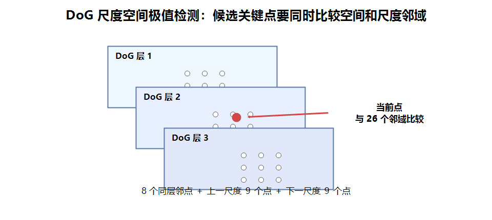
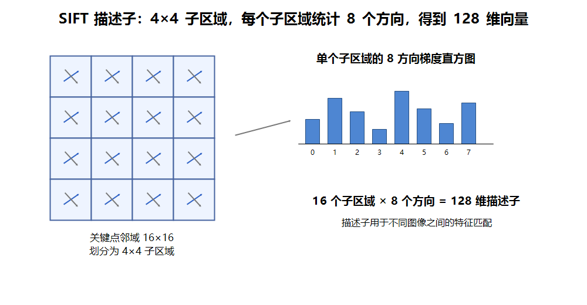
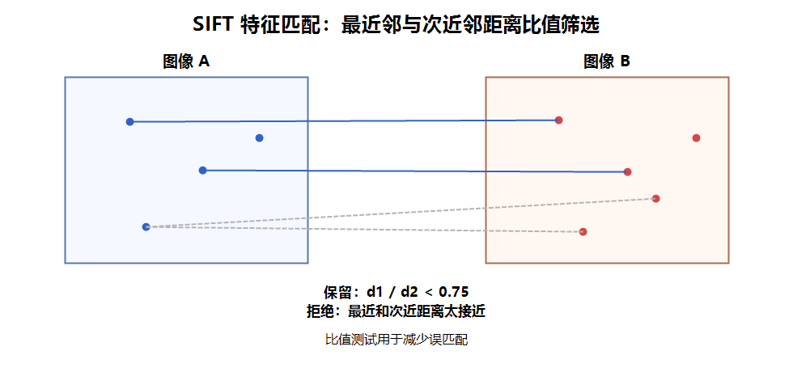

# SIFT 特征检测概述

SIFT 全称是 **Scale-Invariant Feature Transform**，中文通常叫尺度不变特征变换。

需要注意：SIFT 严格来说不是单纯的“角点检测”算法，而是一套完整的 **关键点检测 + 特征描述 + 特征匹配** 方法。它不仅能找到图像中的稳定特征点，还能为每个特征点生成描述子，用于不同图像之间的匹配。

SIFT 的核心优势是：

- 对尺度变化比较稳定；
- 对旋转变化比较稳定；
- 对一定程度的亮度变化和视角变化有较好鲁棒性；
- 可以用于图像匹配、目标识别、图像拼接、三维重建等任务。

和 Harris 相比，Harris 更偏向检测角点位置；SIFT 不仅检测关键点，还会计算每个关键点的方向、尺度和描述子。

| 方法 | 检测内容 | 是否有尺度 | 是否有方向 | 是否有描述子 |
| --- | --- | --- | --- | --- |
| Harris | 角点 | 否 | 否 | 否 |
| SIFT | 尺度空间关键点 | 是 | 是 | 是 |

# SIFT 基本流程

SIFT 的完整流程可以概括为 5 步：

| 步骤 | 作用 | 输出 |
| --- | --- | --- |
| 1. 构建尺度空间 | 在不同尺度下观察图像 | 高斯金字塔、DoG 金字塔 |
| 2. 检测尺度空间极值点 | 找到可能稳定的关键点 | 候选关键点 |
| 3. 精确定位关键点 | 去除低对比度点和边缘响应点 | 稳定关键点 |
| 4. 分配主方向 | 根据局部梯度方向确定关键点方向 | 带方向的关键点 |
| 5. 生成描述子 | 统计关键点邻域的梯度方向信息 | 128 维描述子 |

# 1. 构建尺度空间

现实图像中的同一个目标可能有不同大小。例如，同一个物体离相机近时大，离相机远时小。

如果只在原始图像尺度上检测特征，目标尺寸变化后可能检测不到同一个特征点。因此 SIFT 会构建尺度空间，在不同尺度下寻找稳定特征。

尺度空间通常通过高斯模糊构建：

$$
L(x,y,\sigma) = G(x,y,\sigma) * I(x,y)
$$

其中：

- $I(x,y)$：原始图像；
- $G(x,y,\sigma)$：高斯核；
- $\sigma$：高斯模糊程度，$\sigma$越大图像越模糊；
- $L(x,y,\sigma)$：某个尺度下的模糊图像。

在同一个 octave 内，图像尺寸不变，但 $\sigma$ 逐渐增大；进入下一个 octave 后，图像尺寸会减半。

## 高斯差分金字塔

SIFT 不直接使用高斯图像检测极值，而是使用相邻高斯模糊图像相减得到 DoG 图像：

$$
D(x,y,\sigma) = L(x,y,k\sigma) - L(x,y,\sigma)
$$


# 2. 尺度空间极值检测

SIFT 会在 DoG 尺度空间中寻找局部极值点。**一个候选关键点不仅要在当前图像平面上是极值，还要在相邻尺度上也是极值。**



对于 DoG 中的某个像素点，需要和周围 26 个点比较：

- **当前尺度同一层的 8 个邻域点；**
- **上一尺度的 9 个邻域点；**
- **下一尺度的 9 个邻域点。**

如果当前点比这 26 个点都大，或者都小，就认为它是尺度空间中的候选极值点。

这样做的意义是：**只有在空间位置和尺度方向上都稳定的点，才会被保留下来作为候选关键点。**

# 3. 关键点精确定位

尺度空间极值点只是候选点，还需要进一步筛选。

SIFT 会去除两类不稳定点：

- 低对比度点：响应太弱，容易受噪声影响；
- 边缘响应点：类似边缘上的点，沿边缘方向定位不稳定。

# 4. 关键点方向分配

为了让 SIFT 对旋转变化更稳定，SIFT 会为每个关键点分配一个或多个主方向。

做法是：

1. 以关键点为中心取邻域；
2. 计算邻域内每个像素的梯度幅值和梯度方向；
3. 建立方向直方图；
4. 选择直方图峰值方向作为关键点主方向。

梯度幅值和方向计算方式：

$$
m(x,y) = \sqrt{(L(x+1,y)-L(x-1,y))^2 + (L(x,y+1)-L(x,y-1))^2}
$$

$$
\theta(x,y) = \arctan \frac{L(x,y+1)-L(x,y-1)}{L(x+1,y)-L(x-1,y)}
$$

**有了主方向后，即使图像发生旋转，描述子也可以相对主方向进行统计，从而提升旋转不变性。**

# 5. SIFT 描述子

关键点只说明“哪里有特征”，描述子用于说明“这个特征长什么样”。

SIFT 会在关键点附近取一个邻域，通常划分为 `4×4` 个子区域。每个子区域统计 8 个方向的梯度直方图，因此最终得到：

$$
4 \times 4 \times 8 = 128
$$

也就是说，每个 SIFT 关键点通常对应一个 128 维描述子。



描述子具有以下作用：

- 表示关键点周围的局部纹理和梯度结构；
- 用于不同图像之间的特征匹配；
- 比单纯的像素值更稳定；
- 对旋转和尺度变化有较好的适应能力。

# OpenCV 中的 SIFT 使用方法

OpenCV 中可以通过 `cv2.SIFT_create()` 创建 SIFT 对象：

```python
import cv2

img = cv2.imread("test.jpg")
gray = cv2.cvtColor(img, cv2.COLOR_BGR2GRAY)

# 创建 SIFT 检测器
sift = cv2.SIFT_create()

# 检测关键点并计算描述子
keypoints, descriptors = sift.detectAndCompute(gray, None)

# 绘制关键点
result = cv2.drawKeypoints(
    img,
    keypoints,
    None,
    flags=cv2.DRAW_MATCHES_FLAGS_DRAW_RICH_KEYPOINTS
)
```

返回值说明：

- `keypoints`：关键点列表；
- `descriptors`：描述子矩阵，通常形状为 `(关键点数量, 128)`。

`cv2.DRAW_MATCHES_FLAGS_DRAW_RICH_KEYPOINTS` 可以把关键点的大小和方向也画出来。

## KeyPoint 关键信息

每个 SIFT 关键点是一个 `cv2.KeyPoint` 对象，常用属性包括：

| 属性 | 含义 |
| --- | --- |
| `pt` | 关键点坐标 `(x, y)` |
| `size` | 关键点所在尺度 |
| `angle` | 关键点主方向 |
| `response` | 关键点响应强度 |
| `octave` | 关键点所在 octave |

## SIFT_create 常用参数

```python
sift = cv2.SIFT_create(
    nfeatures=0,
    nOctaveLayers=3,
    contrastThreshold=0.04,
    edgeThreshold=10,
    sigma=1.6
)
```

参数说明：

| 参数 | 含义 |
| --- | --- |
| `nfeatures` | 最多保留多少个特征点，`0` 表示不限制 |
| `nOctaveLayers` | 每个 octave 中的尺度层数 |
| `contrastThreshold` | 对比度阈值，用于过滤低对比度关键点 |
| `edgeThreshold` | 边缘阈值，用于过滤边缘响应点 |
| `sigma` | 初始高斯模糊参数 |

# SIFT 特征匹配

SIFT 描述子可以用于图像匹配。常见方法有：

- 暴力匹配：`cv2.BFMatcher()`；
- FLANN 快速近似匹配：`cv2.FlannBasedMatcher()`；
- KNN 匹配加 Lowe 比值测试。

## BFMatcher + 比值测试

```python
import cv2

img1 = cv2.imread("box.png", cv2.IMREAD_GRAYSCALE)
img2 = cv2.imread("box_in_scene.png", cv2.IMREAD_GRAYSCALE)

sift = cv2.SIFT_create()

kp1, des1 = sift.detectAndCompute(img1, None)
kp2, des2 = sift.detectAndCompute(img2, None)

# 暴力匹配
bf = cv2.BFMatcher()

# 每个描述子找两个最近邻
matches = bf.knnMatch(des1, des2, k=2)

# Lowe 比值测试
good = []
for m, n in matches:
    if m.distance < 0.75 * n.distance:
        good.append(m)

result = cv2.drawMatches(
    img1,
    kp1,
    img2,
    kp2,
    good,
    None,
    flags=cv2.DrawMatchesFlags_NOT_DRAW_SINGLE_POINTS
)
```



比值测试的含义：

- `m` 是最近邻匹配；
- `n` 是次近邻匹配；
- 如果最近邻明显优于次近邻，说明匹配更可靠；
- 如果两者距离很接近，说明匹配可能有歧义，应当舍弃。

常用经验阈值是 `0.75`，实际项目中可以根据数据调整。

# SIFT 的特点和注意点

## 优点

- 对尺度变化稳定；
- 对旋转变化稳定；
- 描述子区分能力强；
- 适合图像匹配、拼接、目标定位等任务；
- 关键点包含位置、尺度和方向信息。

## 缺点

- 计算量比 Harris、ORB 等方法更大；
- 描述子维度较高，匹配成本较高；
- 对大幅视角变化、强透视变换仍可能失效；
- 对纹理较少的图像，能检测到的稳定关键点较少。

## 使用建议

- 如果只需要检测角点位置，可以使用 Harris 或 Shi-Tomasi；
- 如果需要做图像匹配，SIFT 更合适；
- 如果实时性要求高，可以考虑 ORB；
- 如果误匹配较多，可以使用 Lowe 比值测试；
- 如果需要进一步验证匹配结果，可以结合 RANSAC 和单应性矩阵。

# SIFT 与 Harris 对比

| 对比项 | Harris | SIFT |
| --- | --- | --- |
| 检测目标 | 角点 | 尺度空间关键点 |
| 尺度不变性 | 较弱 | 较强 |
| 旋转不变性 | 较弱 | 较强 |
| 是否生成描述子 | 否 | 是 |
| 是否适合匹配 | 一般 | 适合 |
| 计算量 | 较小 | 较大 |

总结：Harris 更适合理解角点检测的基本原理；SIFT 更适合完整的图像特征匹配任务。
